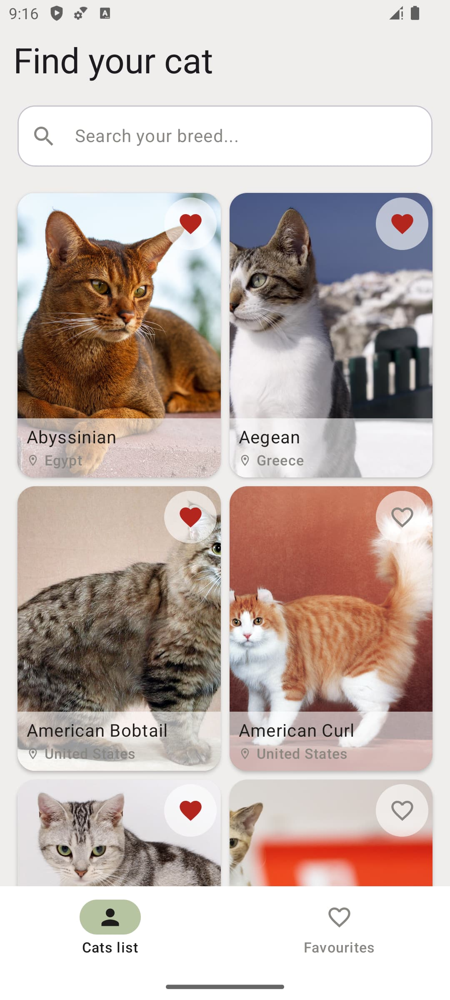
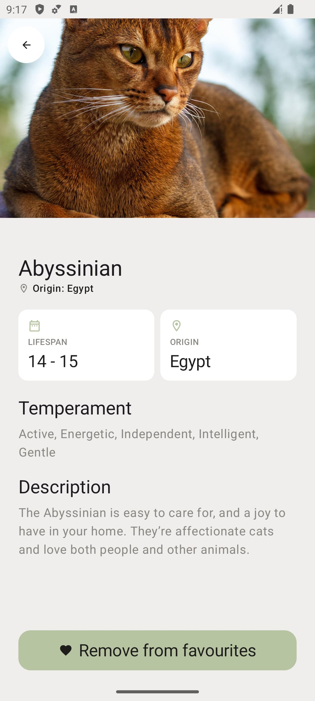
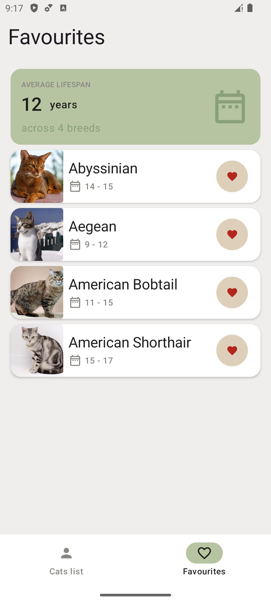
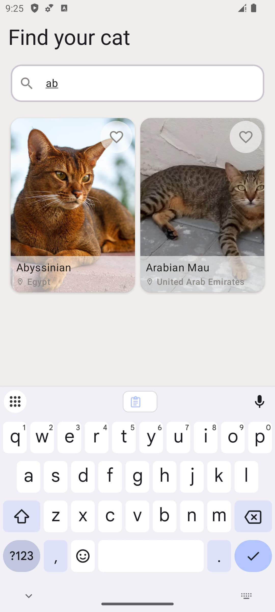
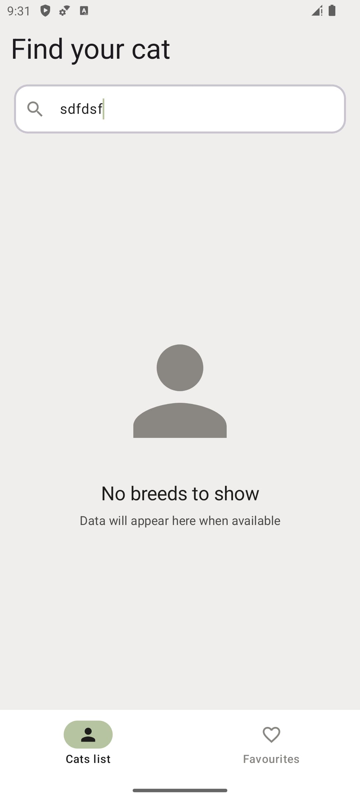
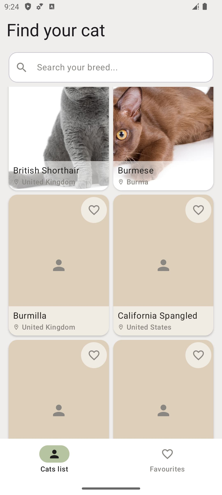

# Sword Cat Challenge

An Android application built as part of the Sword Health hiring process,
consuming [The Cat API](https://thecatapi.com/) to browse cat breeds and
manage favourites.

## Screenshots
<p float="left">
  
  
  
</p>

<p float="left">
  
  
  
</p>


## Architecture

The app follows **Clean Architecture** principles with **MVVM** pattern, organized in a multi-module structure.

## Modules
* :app
* :core:ui 
* :domain:breeds
* :domain:favourites 
* :data:core
* :data:breeds
* :data:favourites
* :feature:breeds
* :feature:favourites  


## Features

- Cat breed list with pagination
- Search breeds by name (remote first, local fallback when offline
- Breed details information view
- Add/remove breeds from favourites
- Favourites screen with average lifespan calculation
- Offline support (breeds are cached locally via Room and served when offline)


## Key Technical Decisions

### Koin over Hilt
Koin was chosen over Hilt for dependency injection. During interview process the company mentioned 
internal KMP libraries, so I thought to give it a try.
This also makes the codebase more aligned with a potential KMP migration path.

### Moshi over Gson
Moshi was chosen for JSON parsing due to its Kotlin-first design. It handles
null safety correctly at parse time also avoids runtime reflection.

### Navigation 3
Navigation 3 (stable as of late 2025) was chosen over Navigation 2 as it is
Compose-first and handles back stack as simple state and a lot easier to implement.

### Offline-First with RemoteMediator
Breeds are loaded using Paging 3's `RemoteMediator` pattern. Pages are fetched remotely and are
wrote down to Room, while `PagingSource` reads exclusively from Room. This makes the database a 
single source of truth and at same gives offline support.

### Local-Only Favourites
Wasn't able to make `/v1/favourites` endpoints work, not sure if it requires some kind of paid access.
So I deliberate chose to store favourites locally.

### Search Strategy
Search uses a remote-first approach with local fallback:
1. Query the API
2. Store results in Room for offline availability
3. If offline, fall back to local `LIKE` query on stored breeds

- Used debounce strategy in search field to avoid excessive API calls


## Testing

Unit tests cover:
- All domain use cases
- Integration tests for the breeds repository using MockWebServer


## Setup

1. Clone the repository
2. Add the following property to your `local.properties` file:

   ```properties
   CAT_API_KEY=<REPLACE_WITH_API_KEY>
   ```


## What I would do next
- ViewModel unit tests for `BreedListViewModel` and `FavouritesViewModel`
- UI/E2E tests with Compose testing APIs
- Breed image offline caching strategy with explicit cache control
- String resources extraction and localization support


